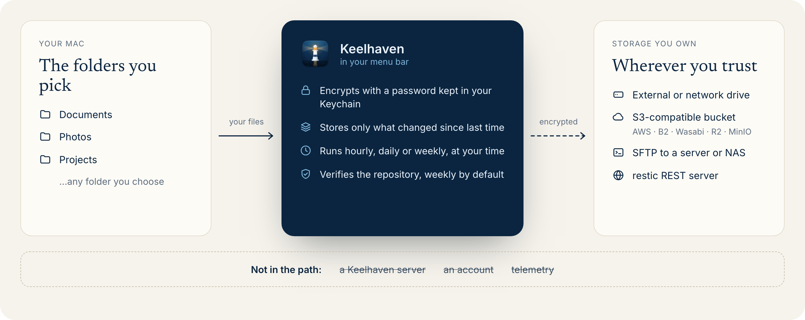

<p align="center">
  
</p>

<p align="center">
  <a href="https://github.com/shenxianpeng/keelhaven/actions/workflows/ci.yml"></a>
  <a href="https://github.com/shenxianpeng/keelhaven/releases/latest"></a>
  <a href="LICENSE"></a>
  <a href="https://keelhaven.app"></a>
</p>

<p align="center">
  <b>Back up your Mac to storage you own.</b><br>
  A free menu bar app that encrypts your folders on your Mac, then backs them up on a schedule to your own drive, bucket or server.
</p>

<p align="center">
  <a href="https://keelhaven.app">Website</a> ·
  <a href="#install">Install</a> ·
  <a href="https://keelhaven.app/#faq">FAQ</a> ·
  <a href="https://keelhaven.app/zh/">简体中文</a>
</p>

## Why Keelhaven

| Encrypted on your Mac | Stored where you choose | Quiet until it matters |
|---|---|---|
| Only you hold the key. | No Keelhaven server in the path. | It speaks up only when something needs you. |

<p align="center">
  
</p>

<p align="center">
  
  
  
</p>
<p align="center"><em>Make a plan · let it run · restore any point in time.</em></p>

## Install

```bash
brew install --cask shenxianpeng/tap/keelhaven
```

Or download the `.dmg` from [keelhaven.app](https://keelhaven.app) — macOS 14 or
later, Apple silicon and Intel. Keelhaven is in public beta and its builds
aren't notarized yet, so the first launch needs one approval; the
[FAQ](https://keelhaven.app/#faq) shows how.

## No lock-in

Every plan is a standard [restic](https://restic.net) repository — restore it on
any Mac or Linux machine, with or without Keelhaven.

## Security

Repository passwords and storage keys live in the macOS Keychain and reach
restic only through its process environment — never on the command line, never
on disk. There is no telemetry: nothing leaves your Mac except your encrypted
backups, to the destination you chose. Report vulnerabilities privately — see
[SECURITY.md](SECURITY.md).

## Contributing

Keelhaven is developed in the open. Setup, project layout and the relicensing
grant that comes with a contribution are in [CONTRIBUTING.md](CONTRIBUTING.md);
module boundaries and design decisions in [docs/ARCHITECTURE.md](docs/ARCHITECTURE.md).

## License

[GPL-3.0-or-later](LICENSE) — the app is free and stays free. The "Keelhaven"
name and icon are not covered by the code license: a fork should ship under its
own name. The bundled [restic](https://restic.net) engine is redistributed
under its own BSD-2-Clause license, shipped in the app bundle and shown in the
About window.
