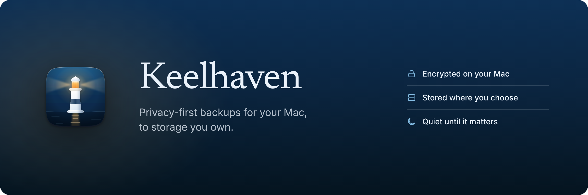

<p align="center">
  
</p>

# Keelhaven

**[keelhaven.app](https://keelhaven.app)**

[](https://github.com/shenxianpeng/keelhaven/actions/workflows/ci.yml)
[](https://github.com/shenxianpeng/keelhaven/releases/latest)
[](https://github.com/shenxianpeng/keelhaven/releases)
[](LICENSE)
[](https://keelhaven.app)
[](https://x.com/xianpengshen)

Privacy-first Mac backup to your own storage. Free and open source (GPLv3) — no subscription, no telemetry.

Keelhaven wraps the battle-tested [restic](https://restic.net) engine in a native SwiftUI menu bar app: pick folders, pick a destination you own (external drive, any S3-compatible bucket, SFTP/NAS, or a restic REST server), set a schedule — your files are encrypted on your Mac before they leave it.

Being a real app bundle rather than a script matters for one macOS permission in particular: `~/Desktop`, `~/Documents` and `~/Downloads` are closed to every process until the user grants **Full Disk Access**, which a command-line tool cannot ask for on its own behalf. Keelhaven checks its source folders before a run, and when macOS does deny access it names the files it could not read — and marks the resulting snapshot as incomplete — instead of reporting a vague failure.

**Status: public beta.** The engine, wizard, scheduled backups, whole-snapshot restore, periodic repository verification, and retention presets all work — app and website in English and Simplified Chinese; file-level browsing inside snapshots is next.

<p align="center">
  
</p>

<p align="center"><em>The menu bar panel, choosing a destination, and restoring
from a point in time. Also in
<a href="docs/assets/screenshots/menu-bar-zh.png">Simplified Chinese</a>.</em></p>

## Install

```bash
brew install --cask shenxianpeng/tap/keelhaven
```

Without Homebrew, one command installs (or updates to) the latest release:

```bash
curl -fsSL https://keelhaven.app/install.sh | bash
```

Or download `Keelhaven-<version>.dmg` from [keelhaven.app](https://keelhaven.app)
or the [latest release](../../releases/latest) and drag the app into
Applications. Either way, beta builds aren't notarized yet, so the very first
launch needs a one-time approval — the [site FAQ](https://keelhaven.app/#faq)
walks through it.

## Contributing and development

Keelhaven is developed in the open. Development setup, the CI install path
for personal builds, and the project layout live in
[CONTRIBUTING.md](CONTRIBUTING.md); module boundaries and design decisions in
[docs/ARCHITECTURE.md](docs/ARCHITECTURE.md).

## Security model (v1)

- Repository password, S3 secret key, and REST server password live in the macOS Keychain, one entry per plan.
- Secrets reach restic only through the child process environment — never argv, never disk.
- The restic child gets a minimal clean environment (`PATH`, `HOME`, `TMPDIR`, `SSH_AUTH_SOCK` + credentials), not the app's.
- Zero telemetry. Nothing leaves your machine except your encrypted backups, to the destination you chose.

## License

Keelhaven is free software under the [GNU General Public License, version 3 or later](LICENSE) (GPL-3.0-or-later): use it, study it, build it, fork it. The app is free and stays free. Contributions come with a relicensing grant that keeps the project's licensing options open for the future — see [CONTRIBUTING.md](CONTRIBUTING.md). The "Keelhaven" name and icon are not covered by the code license: a fork should ship under its own name. The bundled [restic](https://restic.net) engine is redistributed under its own BSD-2-Clause license, shipped in the app bundle and surfaced in the About window.
